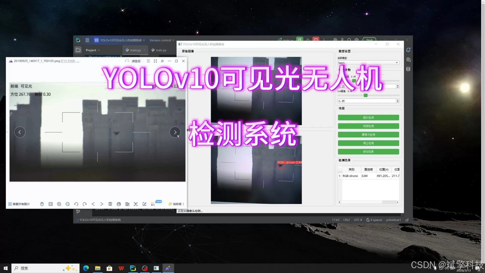
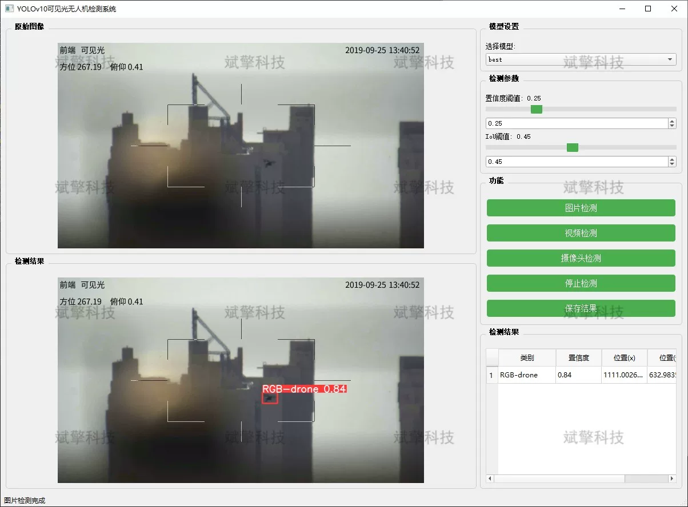
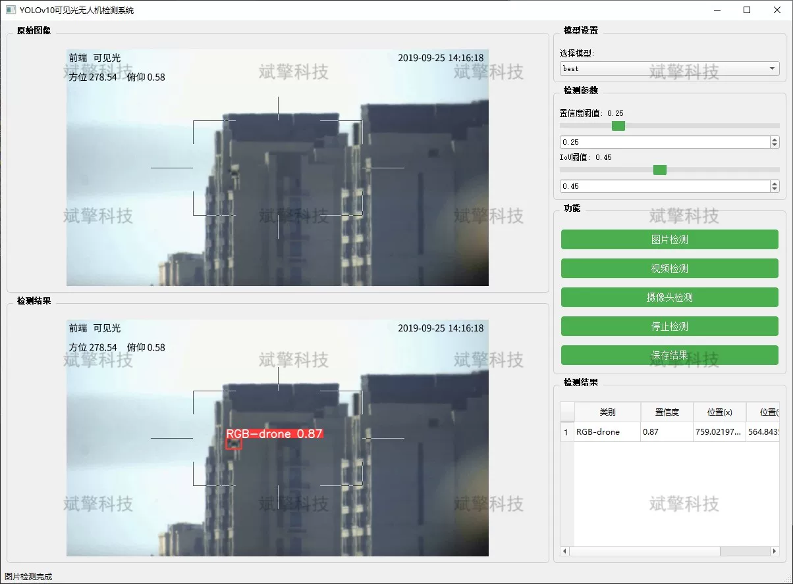
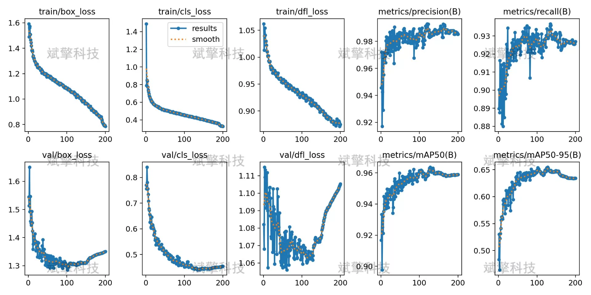
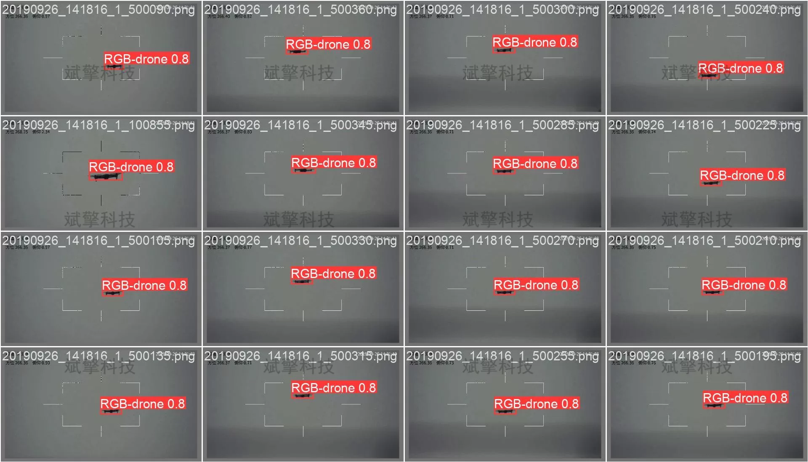

# YOLOv10 Drone Detection System

## Body

YOLOv10 Drone Detection System: A Plant Disease Identification and Detection System Based on the YOLOv10 Deep Learning Model (YOLOv10+YOLO dataset + UI interface + Python project + model)

Plant diseases are one of the main factors affecting crop yield and quality. Traditional manual detection methods are inefficient and subjective, unable to meet the needs of precision management in modern agriculture. This study has constructed a plant leaf disease identification and detection system based on the YOLOv10 deep learning model. The system integrates a plant leaf dataset containing 54,293 images, covering 14 types of plants including apples, blueberries, cherries, corn, grapes, citrus fruits, peaches, chili peppers, potatoes, raspberries, soybeans, pumpkins, strawberries, tomatoes, and more than 38 categories (including diseased and healthy leaves).

This project is based on the latest YOLOv10 (You Only Look Once version 10) deep learning object detection algorithm, designing and implementing a drone detection system for visible light scenes. YOLOv10 provides technical support for drone recognition in complex backgrounds with its end-to-end real-time detection capability and high accuracy. The system has three core functional modules: image detection, video detection, and real-time camera detection, capable of accurately positioning and identifying drones in single images, offline video files, and real-time monitoring scenes. Experimental results show that the system performs excellently on its own drone dataset, demonstrating good robustness and real-time performance, providing an effective visual perception solution for anti-drone systems.

System Features

✅ Image Detection: Can detect images and return detection boxes and category information.

✅ Video Detection: Supports input of video files, detecting each frame in videos.

✅ Real-time Camera Detection: Connects USB cameras for real-time monitoring.

✅ Parameter Real-Time Adjustment (Confidence and IoU Thresholds)

Dataset Introduction

Training set (Train): 5019 images
Validation set (Val): 1233 images

## Images

## Payment

Here is a pay link on Stripe ( https://buy.stripe.com/3cs8yP7sY87d0vu9AB ). Please contact me lonlonago@foxmail.com after funding $89, and I will send you a complete data files , thank you!

